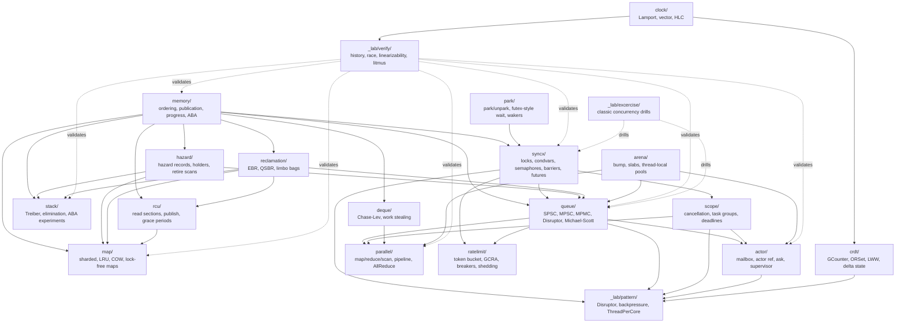

# gopher-forge ROADMAP — Spiral Rust/Go High-Performance Plan

> Target: high-salary, high-moat Rust/Go infrastructure roles: HFT, market
> making, exchange core, crypto infrastructure, FAANG/top-tier infra, AI/agent
> runtime, fintech hot paths, streaming, database/storage engines, high-throughput
> and ultra-low-latency systems. Non-goal: CRUD backend.

## 0. Source of Truth

This roadmap is driven by the package `Index.md` files. The old `TODO.md` files
are no longer treated as authoritative.

Use these documents as the current system map:

- Foundation: `memory/Index.md`, `syncx/Index.md`, `park/Index.md`
- Data structures: `queue/Index.md`, `stack/Index.md`, `map/Index.md`, `deque/Index.md`
- Reclamation/read-mostly: `hazard/Index.md`, `reclamation/Index.md`, `rcu/Index.md`
- Runtime/patterns: `scope/Index.md`, `actor/Index.md`, `parallel/Index.md`, `_lab/pattern/Index.md`
- Verification: `_lab/verify/Index.md`
- Niche/deep tracks: `arena/Index.md`, `clock/Index.md`, `crdt/Index.md`, `_lab/excercise/Index.md`

Local market calibration:

- `docs/research/high_performance_findings_2026-05-27.md`
- `docs/research/high_performance_source_catalog_2026-05-27.tsv`
- `docs/research/hft.md`
- `docs/research/crypto.md`
- `docs/research/ai_infra.md`
- `docs/research/faang.md`
- `docs/research/dubai.md`
- `docs/purpose/syncx_career_value.md`

External web calibration used for this version:

- Go memory model: Go atomics synchronize and behave as sequentially consistent operations.
  <https://go.dev/ref/mem>
- Coinbase market-data architecture: Go channel fan-out was replaced with an
  LMAX-style ring buffer to reduce allocation and latency.
  <https://www.coinbase.com/blog/Optimizing-Producer-Consumer-Architecture-for-Market-Data-at-Coinbase>
- LMAX Disruptor: ring buffer, sequence, sequence barrier, and consumer dependency graph.
  <https://lmax-exchange.github.io/disruptor/user-guide/>
- NVIDIA NCCL: ring, tree, and double-binary-tree collective communication algorithms.
  <https://developer.nvidia.com/blog/massively-scale-deep-learning-training-nccl-2-4/>
- Kubernetes GPU scheduling: device plugins and Dynamic Resource Allocation for
  GPU/cloud control-plane work.
  <https://kubernetes.io/docs/tasks/manage-gpus/scheduling-gpus>
  <https://kueue.sigs.k8s.io/docs/concepts/dynamic_resource_allocation/>
- Cloudflare Pingora: Rust async multithreaded high-performance network service framework.
  <https://blog.cloudflare.com/pingora-open-source/>

## 1. Strategy

The highest-return path is not to implement every primitive deeply on the first
pass. The highest-return path is to build a chain of artifacts that a performance
interviewer can inspect:

```text
memory model -> SPSC ring -> p99 benchmark report -> Disruptor / ThreadPerCore
-> exchange or streaming lab -> Rust atomic proof -> reclamation/deep systems
```

This repo should tell one story:

> I can reason about memory ordering, cache behavior, progress guarantees,
> backpressure, p99 latency, and correctness, then compose those primitives into
> exchange, database, streaming, and AI-runtime systems.

Do not frame the project as a production replacement for `sync`, `crossbeam`,
`parking_lot`, `tokio`, or `folly`. Frame it as a high-performance systems forge.

## 2. Scoring Model

Rank Index items by these axes:

| Axis | Meaning |
|---|---|
| `M` | Moat: separates high-performance engineers from ordinary backend engineers |
| `H` | Hot-path relevance: appears in latency, throughput, p99, or cache-sensitive paths |
| `P` | Portfolio proof: can produce code, tests, benchmarks, reports, and demos |
| `R` | Rust/Go transfer: useful in both Go and Rust systems interviews |
| `I` | Interview frequency in target verticals |
| `D` | Dependency leverage: unlocks many later packages |

Sort rule:

1. Maximize `M + H + P`.
2. Prefer high `D` foundations early.
3. Use `R` to keep Rust/Go roles both viable.
4. Use `I` to avoid beautiful but rarely asked topics too early.
5. Only then consider implementation effort.

## 3. Spiral Execution Model

Run the repo in spirals, not as one deep linear tunnel.

```text
Phase 1: Core pass
  Touch every important package once.
  Build the smallest useful primitive or executable example.
  Goal: vocabulary, API shape, tests, and mental model.

Phase 2: Proof / benchmark / composition pass
  Revisit the same packages.
  Add correctness tools, stress tests, p99 reports, and pattern composition.
  Goal: make claims falsifiable and measurable.

Phase 3: Deep / portfolio pass
  Revisit again.
  Add reclamation, Rust proof, exchange/streaming/database/AI labs.
  Goal: create interview-grade artifacts.
```

This prevents two bad outcomes:

- getting stuck polishing one primitive while the rest of the mental model is missing;
- building flashy portfolio demos before the primitive correctness layer exists.

Current active learning slice:

```text
SPSC implementation
-> memory-focused explanation: publication, linearization, progress, false sharing
-> SPSC tests and p99 benchmark
-> LMAX Disruptor minimum
```

## 4. Current State From Index

Already useful:

- `queue/`: `MutexMPMC`, `MutexMPSC`, `LockFreeMPMC`, `LockFreePaddedMPMC`, `LockFreeMPSC`
- `stack/`: mutex baselines, Treiber stack, elimination-backoff stack
- `syncx/`: spin/ticket/MCS locks, seqlock, semaphore variants, WaitGroup, counting/sense barriers, channel helpers

Highest-value gaps:

- `memory/Index.md`: most items are planned; this is the upstream correctness layer.
- `queue/Index.md`: `LockFreeSPSC` / `LamportSPSCRing`, `LMAXDisruptor`, and `MulticastRingBuffer` drive the low-latency path.
- `_lab/verify/Index.md`: no checker/harness layer yet; benchmarks and correctness claims need this.
- `_lab/pattern/Index.md`: `Disruptor`, `ThreadPerCore`, `PipelineBackpressure`, and `BackpressurePolicyMatrix` compose primitives into architecture.
- Rust proof is missing from the repo structure; add it after Go SPSC and memory notes.
- `hazard/`, `reclamation/`, `rcu/`: planned; needed for deep Rust/HFT/DB credibility.

## 5. Dependency Graph



## 6. Package Roadmap: Phase 1 Core Pass

Phase 1 runs across the repo once. Each package should produce one small,
inspectable artifact or a deliberate scaffold with tests where appropriate.

| Package | Phase 1 items | Mental model trained | Why now |
|---|---|---|---|
| `memory/` | `AtomicLoadStore`, `CompareAndSwap`, `FetchAddCounter`, `AcquireReleasePairing`, `PublicationSafety` | Visibility, ownership, publication, single-location atomicity | Upstream of every lock-free or wait-free claim |
| `syncx/` | `Once`, `OnceValue`, `MesaQueueCond`, finish `MutexLock` scaffold, `WeightedSemaphore` | State machines, lost wakeups, publication, parking vs spinning | Covers senior interview floor and unlocks blocking queues |
| `park/` | `Parker`, `PermitParker`, `SpuriousWakeupContract` | Register-before-sleep, wake-one vs broadcast, lost wakeups | Needed before custom sleeping primitives become credible |
| `queue/` | `LamportSPSCRing`, finish `LockFreeSPSC`, SPSC tests, `BlockingBoundedQueue` baseline | FIFO, producer/consumer ownership, full/empty, backpressure | Highest shared signal for HFT, exchange, streaming, AI inference |
| `stack/` | `TreiberABAExperiment`, invariants for existing Treiber stack | CAS loops, ABA, linearization point | Bridges current stack code to memory/reclamation learning |
| `map/` | `ShardedMutexMap`, `ThreadSafeLRU` | Sharding, lock striping, recency mutation on reads | FAANG/top-tier interview floor |
| `deque/` | `MutexDeque`, `BoundedRingDeque` | Double-ended ownership, baseline before Chase-Lev | Prepares work stealing without weak-memory complexity |
| `ratelimit/` | `TokenBucket`, `SlidingWindowCounter`, `Bulkhead` | Admission control, local counters, bounded concurrency | Direct interview utility for FAANG, Dubai, fintech, inference |
| `scope/` | `CancellationToken`, `ErrGroupClone`, `TaskGroup` | Goroutine lifetime ownership and failure propagation | Required Go senior mental model |
| `actor/` | `Mailbox`, `ActorInterface`, `ActorRef`, minimal `AskPattern` | Isolated state, message ownership, request/reply | Prepares AI/agent runtime and actor-based systems |
| `parallel/` | `ParallelMap`, `ParallelFor`, `WorkerPool`, `ParallelReduce` | Work/span, partitioning, synchronization points | Prepares scan, pipeline, AllReduce, and work stealing |
| `_lab/verify/` | `HistoryRecorder`, `RaceDetectorHarness`, simple `RandomizedSchedulerHarness` | Correctness as workload, not intuition | Needed to falsify broken primitives |
| `_lab/pattern/` | `MonitorObject`, `ShareByCommunicating`, minimal `PipelineBackpressure` | Primitive composition, bounded stages, shutdown policy | Turns primitives into architecture vocabulary |
| `hazard/` | `Domain`, `HazardRecord`, `Holder` API sketch and tests for ownership rules | Announce-before-dereference | Prepare Treiber/Michael-Scott upgrades |
| `reclamation/` | `ReclamationDomain`, `EBRGuard`, `LimboBags` scaffold | Reader epochs, deferred destruction | Prepare lock-free linked structures |
| `rcu/` | `RCUReadSection`, `AssignPointer`, `Dereference` toy implementation | Read-mostly publish/snapshot model | Prepare COW/RCU maps and read-mostly routing tables |
| `arena/` | `BumpAllocator`, `ResettableRegion`, `AllocationBenchmarkSuite` baseline | Lifetime region and allocation jitter | Useful for HFT/database/AI memory stories |
| `clock/` | `LamportClock`, `VectorClock`, `ManualClock` | Causal order and deterministic time | Foundation for distributed-system reasoning and verify tools |
| `crdt/` | `GCounter`, `PNCounter`, `GSet`, `LWWRegister` | Monotonic merge and convergence | Minimal distributed-state pass without going niche too early |
| `_lab/excercise/` | `PrintInOrder`, `ProducerConsumerBoundedBuffer`, `DiningPhilosophers` | Interview drill vocabulary | Practice only; do not let this drive the roadmap |

Phase 1 deliverable rule:

- one focused test file per implemented item;
- a short invariant comment or note for every concurrent primitive;
- no claim of production-grade behavior;
- no advanced lock-free map or Michael-Scott queue before reclamation exists.

## 7. Package Roadmap: Phase 2 Proof / Benchmark / Composition Pass

Phase 2 revisits the same packages and asks: can this claim be falsified,
benchmarked, or composed into a recognizable system?

| Package | Phase 2 items | Proof / benchmark / composition target |
|---|---|---|
| `memory/` | `FalseSharing`, `ProgressGuarantees`, `LinearizationPoint`, `ABAProblem`, `LitmusTests` | SPSC and Treiber explanation notes; litmus examples; false-sharing benchmark |
| `syncx/` | `TTASLock`, `BackoffSpinLock`, `FairSemaphore`, `TimeoutSemaphore`, `CyclicBarrier`, `BarrierAction` | spin/ticket/MCS/TTAS benchmark; semaphore fairness/starvation tests; cond lost-wakeup tests |
| `park/` | `WaiterQueue`, `TimeoutPark`, `WakerRegistration` | cancellation-safe wait queues and wakeup-race tests |
| `queue/` | SPSC/channel/MPSC/MPMC p99 benchmark, `LMAXDisruptor`, `MulticastRingBuffer`, `LaggingReceiverPolicy` | p50/p95/p99 report; slow-consumer policy matrix; channel allocation comparison |
| `stack/` | `EliminationArray`, `TreiberWithTaggedPointer`, bug-catching tests | ABA demonstration and elimination-backoff contention benchmark |
| `map/` | `StripedRWMutexMap`, `SyncMapClone`, `CopyOnWriteMap` | read-heavy vs write-heavy benchmark; weak iteration and snapshot semantics |
| `deque/` | `ChaseLevDeque`, `StealPolicyExperiments` | owner-fast/thief-CAS model and work-stealing stress tests |
| `ratelimit/` | `GCRA`, `CircuitBreaker`, `LoadShedding`, `QueueDepthBackpressure` | overload policy benchmark and failure-domain demo |
| `scope/` | `TokenTree`, `BoundedTaskGroup`, `DeadlineScheduler`, `CooperativeCancellationBenchmark` | cancellation propagation and bounded concurrency under deadlines |
| `actor/` | `BoundedMailbox`, `RequestReplyCorrelation`, `Supervisor`, `GracefulShutdown` | mailbox overflow, late replies, shutdown order |
| `parallel/` | `ParallelScanHillisSteele`, `ParallelScanBlelloch`, `PipelineWithBackpressure`, `AllReduceRing`, `AllReduceTree` | work/span notes and NCCL-style ring vs tree comparison |
| `_lab/verify/` | `LinearizabilityChecker`, `PropertyBasedConcurrentRunner`, `FairnessStarvationChecker`, `LitmusRunner` | deliberately broken queue/stack/lock cases caught by harnesses |
| `_lab/pattern/` | `Disruptor`, `BackpressurePolicyMatrix`, `ThreadPerCore`, `HalfSyncHalfAsync` | runnable market-data or streaming examples with overload policy |
| `hazard/` | `ProtectReloadLoop`, `ResetProtection`, `RetireList`, `ScanAndReclaim` | hazard pointer protocol tests and Treiber integration prep |
| `reclamation/` | `TryAdvanceEpoch`, `StalledParticipantDetection`, `QSBR`, `ReclamationStressHarness` | stalled reader and delayed reclamation stress cases |
| `rcu/` | `SynchronizeRCU`, `QSBRRCU`, `RCUCorrectnessTests` | grace-period tests and read-mostly benchmark |
| `arena/` | `TypedArena`, `ThreadLocalArena`, `SlabAllocator` | allocation jitter and per-worker allocation benchmark |
| `clock/` | `HybridLogicalClock`, `VersionVector`, `ClockSkewSimulator` | ordering under skew and distributed-system interview examples |
| `crdt/` | `ORSet`, `LWWMap`, `ORMap`, `CRDTAlgebraPropertyTests` | associativity/commutativity/idempotence property tests |
| `_lab/excercise/` | `ReadersWriters`, `RendezvousAndMultiplex`, `H2OBuilder`, `StarvationAndLivelockLabs` | targeted practice after the real packages have coverage |

Phase 2 deliverable rule:

- benchmark when performance is part of the claim;
- at least one broken variant or adversarial test for each checker;
- explicit overflow, shutdown, fairness, and cancellation policy for composed patterns.

## 8. Package Roadmap: Phase 3 Deep / Portfolio Pass

Phase 3 builds the high-moat artifacts that map directly to target verticals.

| Package | Phase 3 items | Portfolio target |
|---|---|---|
| `memory/` | `AtomicRefcount`, `TaggedVersionedPointers`, `FenceCheatsheet`, Rust ordering comparison | Rust `Arc<T>` and Rust SPSC safety proof |
| `syncx/` | `CombiningTreeBarrier`, `TournamentBarrier`, `DisseminationBarrier`, `Phaser`, `FuturePromise`, `CancellableFuture`, selected `STM` | AI training/NCCL signal, async runtime signal, crypto L1 specialization |
| `park/` | `FutexWaitWake`, `FutexMutex`, `AtomicWaitNotify`, `SchedulerHandoff` | sleeping mutex and runtime internals study |
| `queue/` | `MichaelScottQueue`, `VyukovIntrusiveMPSC`, `SPMCRing`, optional `WaitFreeQueue` study | deep lock-free queue and runtime scheduler stories |
| `stack/` | `TreiberWithHazardPointers`, `LockFreeFreelist`, `FlatCombiningStack` | reclamation-backed Treiber proof |
| `map/` | `LeftRightMap`, `RCUMap`, `LockFreeOpenAddressingMap`, `ConcurrentResizeProtocol` | database/vector/routing-table read-mostly systems |
| `deque/` | `WorkStealingInjector`, `WorkStealingPool`, `ResizableChaseLevDeque` | parallel runtime and `crossbeam-deque` interview transfer |
| `ratelimit/` | `AdaptiveConcurrencyLimiter`, `PriorityLimiter`, `DistributedLimiter`, `CreditBasedBackpressure` | inference gateway, exchange risk gate, fintech hot path |
| `scope/` | `Nursery`, `ResultGroup`, `ResourceScope`, `JoinOnScopeExit` | structured concurrency library-quality story |
| `actor/` | `Scheduler`, `SupervisionTree`, `RestartStrategy`, `DeathWatchMonitor`, `Router` | Ray/actor/runtime control-plane story |
| `parallel/` | `ParallelFilter`, `ParallelMergeSort`, `ParallelBFS`, `ForkJoin`, `WorkStealingScheduler`, `MapReduceLocal`, `ParallelFrontierEngine` | query engine, graph engine, AI scheduler story |
| `_lab/verify/` | `HappensBeforeDetector`, `DPORScheduleExplorer`, `ModelCheckingHarness`, `ScheduleTraceVisualizer` | correctness-focused systems credibility |
| `_lab/pattern/` | `Reactor`, `Proactor`, `LeaderFollowers`, `StagedEventDrivenArchitecture`, `BulkheadAndBreakerPattern`, `SupervisedWorkerPool` | production architecture vocabulary |
| `hazard/` | `HazardPointerSpecTests`, `TreiberIntegration`, `MichaelScottIntegration` | safe lock-free linked structures |
| `reclamation/` | `HazardVsEpochComparison`, `DeferredReferenceCounting`, `IntervalBasedReclamation` | Rust/C++ reclamation comparison |
| `rcu/` | `URCU`, `CallRCU`, `RCUBarrier`, `SRCU`, `RCUList`, `RCUMap` | Linux/kernel-style read-mostly systems |
| `arena/` | `ConcurrentBumpAllocator`, `PerWorkerPool`, `LockFreeFreelistPool`, `PoolAllocator`, `ArenaDebugMode` | zero-allocation hot-path and memory lifecycle story |
| `clock/` | `MatrixClock`, `DottedVersionVector`, `CausalBroadcastMetadata`, `TimerWheel`, `DeadlineHeap` | distributed DB and scheduling specialization |
| `crdt/` | `MVRegister`, `RGAList`, `DeltaStateReplication`, `AntiEntropyGossip` | collaborative/distributed state specialization |
| `_lab/excercise/` | remaining classic puzzles only as interview drills | practice, not portfolio core |

Phase 3 deliverable rule:

- each portfolio lab must have a runnable demo, p99 or throughput report, and a
  written explanation of correctness and overload behavior;
- Rust/C++ companion work should be small but rigorous, with safety comments and
  ordering explanations;
- do not call a primitive production-grade unless `_lab/verify` can falsify at
  least one broken version of the same family.

## 9. Vertical Tracks

Use these tracks to pull Phase 2 or Phase 3 items forward when a job target
demands it.

### HFT / Exchange / Market Data

```text
memory publication -> SPSC -> p99 benchmark -> Disruptor -> ThreadPerCore
-> single-writer matching lab -> Rust/C++ SPSC proof
```

Pull forward:

- `queue/LamportSPSCRing`
- `queue/LMAXDisruptor`
- `_lab/pattern/ThreadPerCore`
- `_lab/pattern/BackpressurePolicyMatrix`
- `ratelimit/TokenBucket`
- `arena/ThreadLocalArena`

### Crypto L1 / Validator / Parallel Execution

```text
memory -> parallel execution -> STM/OCC -> clock/causal order
-> reclamation/RCU -> Rust proof
```

Pull forward:

- `parallel/ParallelReduce`, `parallel/PipelineWithBackpressure`
- `syncx/STM`
- `clock/LamportClock`, `clock/VectorClock`
- `map/ShardedMutexMap`
- `reclamation/EpochBasedReclamation`
- Rust Treiber with `crossbeam-epoch`

### AI Inference / Agent Runtime

```text
queue scheduler -> ratelimit/admission -> scope cancellation
-> actor mailbox -> backpressure pattern -> inference gateway lab
```

Pull forward:

- `queue/BlockingBoundedQueue`
- `ratelimit/TokenBucket`, `ratelimit/GCRA`, `ratelimit/LoadShedding`
- `scope/CancellationToken`, `scope/BoundedTaskGroup`
- `actor/Mailbox`, `actor/AskPattern`
- `_lab/pattern/PipelineBackpressure`

### AI Training / NCCL / GPU Runtime

```text
barriers -> reduce/scan -> AllReduceRing/Tree -> p99/latency comparison
-> toy collective lab
```

Pull forward:

- `syncx/CombiningTreeBarrier`
- `syncx/DisseminationBarrier`
- `parallel/ParallelReduce`
- `parallel/AllReduceRing`
- `parallel/AllReduceTree`

### Database / Streaming / Storage

```text
SPSC/backpressure -> ThreadPerCore -> append log / group commit
-> LRU/cache -> RCU/EBR -> arena allocation
```

Pull forward:

- `queue/LamportSPSCRing`
- `_lab/pattern/ThreadPerCore`
- `parallel/PipelineWithBackpressure`
- `map/ThreadSafeLRU`, `map/CopyOnWriteMap`
- `rcu/RCUPointer`
- `arena/BumpAllocator`

### FAANG / Dubai Senior Backend Floor

```text
bounded queue -> thread-safe map/LRU -> rate limiter -> context cancellation
-> semaphore/bulkhead -> system-design writeups
```

Pull forward:

- `queue/BlockingBoundedQueue`
- `map/ShardedMutexMap`
- `map/ThreadSafeLRU`
- `ratelimit/TokenBucket`
- `ratelimit/CircuitBreaker`
- `scope/CancellationToken`
- `syncx/WeightedSemaphore`

## 10. Near-Term Execution

Because `LockFreeSPSC` is the active slice, do this before `LMAXDisruptor`:

```text
1. memory/SPSC subset:
   AtomicLoadStore, AcquireReleasePairing, PublicationSafety,
   FalseSharing, LinearizationPoint, ProgressGuarantees.

2. queue/SPSC completion:
   generic SPSC API, FIFO/full/empty/wraparound tests,
   SPSC concurrent conservation test, race detector run.

3. queue/SPSC benchmark:
   channel vs SPSC vs MPSC vs MPMC vs padded MPMC,
   p50/p95/p99 and allocation report.

4. short note:
   docs/notes/spsc-ring.md or package comment with invariants,
   linearization points, progress guarantee, and contract.
```

Then move to:

```text
LMAXDisruptor minimum -> slow-consumer policy -> ThreadPerCore example
```

## 11. Definition of Done

Every roadmap item that moves from `[ ]` or `[~]` to `[x]` in an `Index.md` must have:

- code;
- unit tests;
- at least one concurrency/race/stress test when relevant;
- benchmark when performance is part of the claim;
- a short note explaining invariants and linearization/progress where relevant;
- Index status updated in the same change.

Do not mark an item `[x]` just because a type exists.

For lock-free items, also require:

- identified linearization point;
- progress guarantee statement;
- memory-ordering explanation;
- broken-variant or stress test where practical.

For pattern labs, also require:

- runnable example;
- explicit backpressure/overflow/shutdown policy;
- one benchmark or stress case if the pattern is performance-related.

## 12. What Not To Do Yet

- Do not implement more lock variants before SPSC, Disruptor, and p99 reports.
- Do not start full CRDT/clock suites unless targeting distributed DB, crypto L1,
  collaborative systems, or causal-ordering interview prep.
- Do not implement lock-free maps before reclamation exists.
- Do not build a large actor framework before `scope/`, `FuturePromise`, and bounded mailboxes exist.
- Do not build advanced barriers before deciding to target AI training/NCCL-style roles.
- Do not call a primitive production-grade if `_lab/verify` cannot falsify at least one broken version.

## 13. One-Line Summary

```text
Spiral path:
Phase 1 core pass across packages
-> Phase 2 proof / benchmark / composition pass
-> Phase 3 deep / portfolio pass

Active spine:
memory -> SPSC -> p99 report -> Disruptor/ThreadPerCore
-> exchange + database/streaming labs -> Rust proof
-> hazard/EBR/RCU/deque/arena specialization
```

This keeps the project aligned with the package `Index.md` structure, the local
research docs, and the current Rust/Go high-performance market signal.
